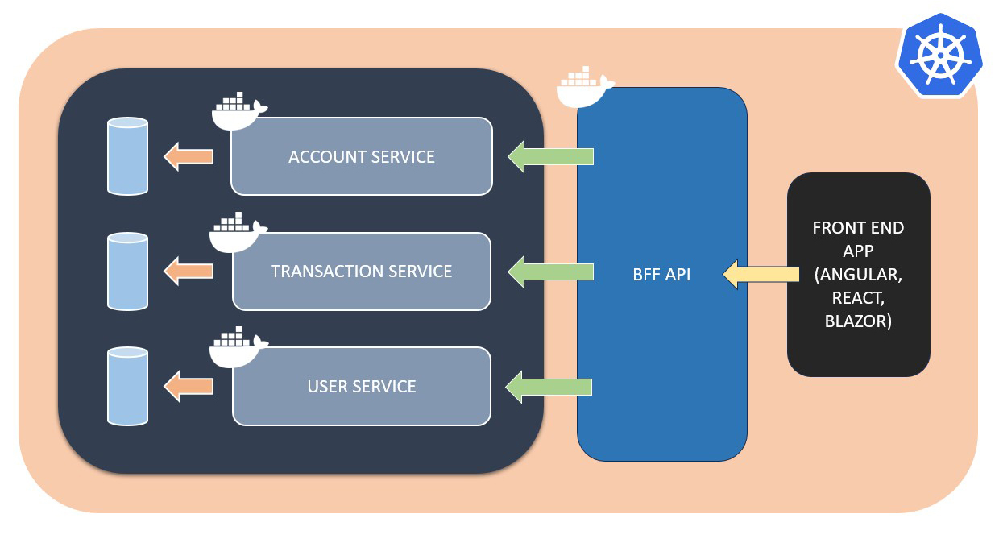

# Guide

## Services

The project was designed based on microservice architecture. Accordingly, the project includes 3 main microservices and 1 BFF (Back-End for Front-End) service.



### Account Service (API):
Account Service is  created to handle the user's requirements related to account transactions.

**Ports:**

`> http://localhost:3201/swagger`

`> https://localhost:3202/swagger`

### Transaction Service (API):
Transaction Service is  created to handle the requirements related to the transaction operations of the user's accounts.

**Ports:**

`> http://localhost:3205/swagger`

`> https://localhost:3206/swagger`

#### User Service (API):
User Service is  created to handle the requirements related to user transactions.

**Ports:**

`> http://localhost:3203/swagger`

`> https://localhost:3204/swagger`

#### BFF (Web.BFF.API)
BFF Service is created to meet the requirements of the interface (front-end) application.

**Ports:**

`> http://localhost:3299/swagger`

`> https://localhost:3298/swagger`

## Logging and Monitoring Services

### ElasticSearch
System logs are configured to be stored on ElasticSearch.

**Ports:**

`> http://localhost:9200`

### Kibana
Kibana is configured to monitor system logs.

**Ports:**

`> http://localhost:5601`

## How to Test?

**NOTE: All services must be running in order to fully test the project.**

There is a simple data in the memory for test case:

**User**
- Id (UserId): 1000001
- Name: Mustafa
- Surname: Çiçek

**Account**
- Id: 2000001
- CustomerId: 1000001

**Transaction:**
- Id: 3000001
- AccountId: 2000001
- Amount: 1000
- TransactionType: Deposit

### Manual Test

**To create a new account via the BFF API, a request can be made as follows:**

**End Point:** POST /api/accounts
**Request Body:**

```json
{
  "customerId": 1000001,
  "amount": 1000,
  "transactionType": 1
}
```

---

**To retrieve the accounts and transactions of a user (customer) via the BFF API, a request can be made as follows.**

**End Point:** GET /api/users/{userId}
**Request Body:**

Change the **{userId}** with: 1000001

**Response Body:**
```json
{
  "user": {
    "userId": 1000001,
    "name": "Mustafa",
    "surname": "Çiçek",
    "accounts": [
      {
        "accountId": 2000001,
        "transactions": [
          {
            "transactionId": 3000001,
            "amount": 1000,
            "transactionType": 1
          }
        ]
      }
    ]
  }
}
```

## How To Run?

**Basically:** Swagger integration has been done in all projects. It automatically redirects when run directly with Rider or Visual Studio. Otherwise, the API documentation can be accessed by typing "/swagger" at the end of the URL. 

### Alternatives

Alternatively, the project can be run using the following methods.

### PowerShell (Windows):

Open a terminal and go to the Solution directory of the project. You can use the PowerShell command file named **"RunAllProjects.ps1"** in this directory.

You can find instructions within the script.

> .\RunAllProjects.ps1

PS: Also, you can use the test command file **"RunAllTests.ps1"** to run all Unit Tests.

> .\RunAllTests.ps1

### Bash (Unix):

Open a terminal and go to the Solution directory of the project. You can use the Bash command file named **"RunAllProjects.ps1"** in this directory.

You can find instructions within the script.

> ./RunAllProjects.sh

PS: Also, you can use the test command file **"RunAllTests.sh"** to run all Unit Tests.

> ./RunAllTests.sh

### Docker-Compose:

Open a terminal and go to the Solution directory of the project. You can use the Docker-Compose file named **"docker-compose.yaml"** in this directory.

You can find instructions within the script.

> docker-compose up -d

### Kubernetes

Open a terminal and go to the API directory of the each project. You can use the file named **"deployment.yaml"** in the directory.

> kubectl apply -f deployment.yaml

## Framework and Tools

- .NET Core 7: https://docs.microsoft.com/en-us/dotnet/core
- ASP.NET Core 7: https://docs.microsoft.com/en-us/aspnet/core | https://learn.microsoft.com/en-us/aspnet/core/tutorials/first-web-api?view=aspnetcore-7.0&tabs=visual-studio
- MediatR: https://github.com/jbogard/MediatR
- NUnit: https://github.com/nunit/nunit | https://docs.microsoft.com/en-us/dotnet/core/testing/unit-testing-with-nunit
- FluentValidation: https://github.com/FluentValidation/FluentValidation
- Serilog: https://github.com/serilog/serilog
- Swagger (Swashbuckle): https://github.com/domaindrivendev/Swashbuckle.AspNetCore
- Docker: https://www.docker.com | https://docs.docker.com/language/dotnet/ | https://learn.microsoft.com/en-us/dotnet/core/docker/introduction
- Kubernetes: https://kubernetes.io

# Pattern and Practices
- SOLID Principles
- Microservices: https://microservices.io
- Dependency Injection
- In-Memory Cache: https://learn.microsoft.com/en-us/aspnet/core/performance/caching/memory?view=aspnetcore-7.0
- CQRS: https://microservices.io/patterns/data/cqrs.html
- Unit Testing Best Practices (with simple examples): https://docs.microsoft.com/en-us/dotnet/core/testing/unit-testing-best-practices
- Health Check: https://microservices.io/patterns/observability/health-check-api.html

## Storages & Monitoring
- ElasticSearch (Logging Storage): https://www.elastic.co/elasticsearch
- Kibana (Logging Monitoring): https://www.elastic.co/kibana

## Other Challenge Projects (for Reference)
- PowerPlant: https://github.com/mstfcck/PowerPlant
- SmartCharging: https://github.com/mstfcck/SmartCharging
- Railroad: https://github.com/mstfcck/Railroad
- EscapeMines: https://github.com/mstfcck/EscapeMines


